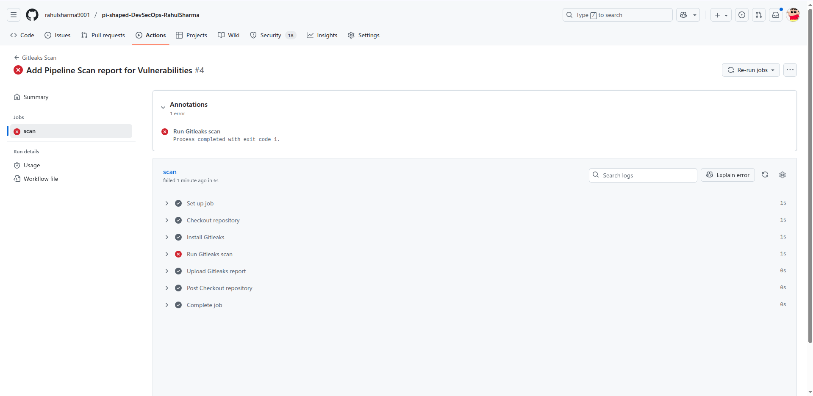

# Day 1: Introduction to DevSecOps & Shift-Left Security

## Objective
The goal is to show how shift-left security works by scanning a Flask app for secrets, cleaning them up, and deploying it securely using Docker. This helps catch security issues early, making the app safer and easier to manage.

## Sample Code
Used a simple Flask app (`app.py`) with initially hardcoded secrets.

## Gitleaks Setup and Execution
- **Steps to Set Up Gitleaks**:

  **Install Gitleaks Locally**:

    - Download the latest binary (e.g., for Linux):

       ```bash
            cd ~/Desktop/Security_Compliance_workshop-RahulSharma/Day-1/tools
            
            curl -LO https://github.com/gitleaks/gitleaks/releases/download/v8.28.0/gitleaks_8.28.0_linux_x64.tar.gz

            tar -xzvf gitleaks_8.28.0_linux_x64.tar.gz

            mv gitleaks_8.28.0_linux_x64 gitleaks

            chmod +x gitleaks- Configured custom rules in `.gitleaks.toml` for precision.
        ```

- Ran locally: `gitleaks detect --source . -v`

- Integrated in GitHub Actions for CI automation (workflow in `.github/workflows/gitleaks.yml`).

Before removal:





After removal:


## Steps to Remove Secrets
1. Replaced hardcodes with `os.getenv` in `app.py`.
2. Used BFG to clean Git history: `java -jar bfg.jar --replace-text secrets.txt .git`.
3. Added `.env` for local secrets (ignored via `.gitignore`).
4. Re-committed and verified.

## Challenges and Resolutions
- **Challenge:** Secrets in history. **Resolved:** BFG for cleanup.
- **Challenge:** Env var injection in Docker. **Resolved:** `--env-file` flag.

## Application Deployment
- Built Docker image: `docker build -t flask-app .`
- Ran: `docker run -p 5000:5000 --env-file .env flask-app`
- Screenshot:

- Works post-cleanup; secrets from env vars.

## Lessons Learned

- **Shift-Left Saves Time:** Catching issues early (like secrets) avoids big headaches later. Fixing problems in development is way cheaper than in production.
- **Automation Rocks:** Using CI with Gitleaks keeps security consistent without manual checks. It’s like having a robot buddy watching your code 24/7.
- **Secrets Need Care:** Hardcoding is risky; env vars and tools like BFG are lifesavers. Also learned that defaults in Dockerfiles can trigger warnings better to pass secrets at runtime.
- **Persistence Pays Off:** Debugging CI mismatches (e.g., file naming) and network issues (like port conflicts) taught me to double-check every step and use logs to troubleshoot.
- **Documentation Helps:** Writing clear steps and lessons makes it easier to share knowledge and repeat the process later.

## Core Concept Questions
#### 1. Explain Shift-Left Security and Why It’s Important in DevSecOps:

Imagine building a house. If you find a crack in the wall after it’s done, fixing it is super hard and expensive. Shift-left security is like checking for cracks while you’re laying the bricks! It means adding security checks right from the start—during coding or design—rather than waiting until the app is in production. In DevSecOps, this is a big deal because it helps us catch problems (like secret leaks) early, saves money, and keeps our apps safer from hackers.


#### 2. How Does Detecting Secrets Early in the CI/CD Pipeline Prevent Production Vulnerabilities?:

Think of the CI/CD pipeline as a factory line for your app. If we spot a secret (like an API key) sneaking into the code early, the pipeline can stop and say, “Whoa, hold up!” This stops the app from going to production with that secret exposed, where hackers could find it. It’s like catching a leak before the water floods the house—much easier to fix early!


#### 3. What Strategies Can Be Used to Store Secrets Securely Instead of Hardcoding Them?:

Hardcoding secrets is like writing your house key on your door—anyone can use it! Instead, we can use:

- Environment Variables: Like using a .env file that the app reads at runtime.
- Secret Managers: Tools like HashiCorp Vault or AWS Secrets Manager that lock secrets away safely.
- Encrypted Configs: Store secrets in files that need a password to unlock.
- Kubernetes Secrets: If using Kubernetes, these keep secrets secure in the cluster.


This way, secrets stay hidden and safe!


#### 4. Describe a Situation Where a Secret Could Still Be Exposed Even After Scanning, and How to Prevent It:

Even after scanning, a secret might pop up if, say, you accidentally log it in a file or build artifact (like a log saying “API Key: sk_test_123”). Imagine leaving a spare key in a public logbook! To prevent this:

- Redact Logs: Make sure logs hide sensitive data.
- Scan Artifacts: Check build outputs with Gitleaks too.
- Rotate Secrets: Change secrets regularly so old ones don’t matter.

## Diagram: Shift-Left Pipeline
**Dev -> CI Scan -> Deploy**
```
        [Develop] --> [CI Scan (Gitleaks)] --> [Deploy]
        ↑                        ↑                ↑
        Security Checks      Catch Secrets    Safe Release
        Early                Early            To Production
```